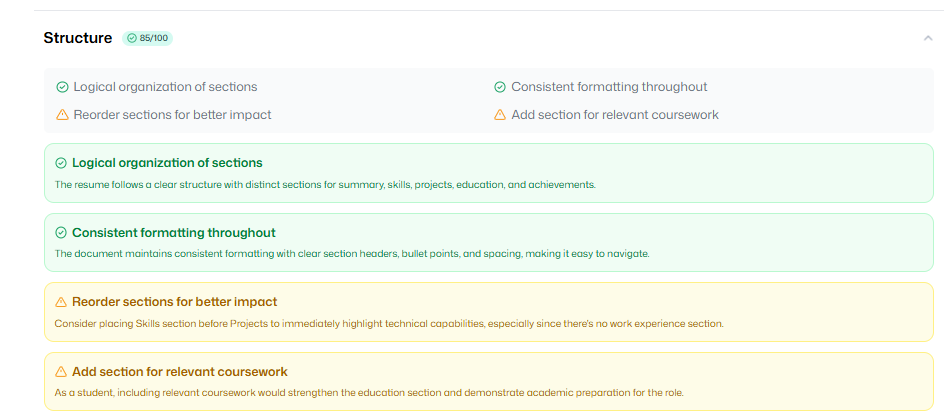

<div align="center">
  <h3 align="center">AI Powered Resume Analyzer</h3>
</div>
  <div align="center">
    
        
        
    
  </div>


## 📋 <a name="table">Table of Contents</a>

1. ✨ [Introduction](#introduction)
2. ⚙️ [Tech Stack](#tech-stack)
3. 🔋 [Features](#features)
4. 🤸 [Quick Start](#quick-start)


## <a name="introduction">✨ Introduction</a>

Build an AI-powered Resume Analyzer with React, React Router, and Puter.js! Implement seamless auth, upload and store resumes, and match candidates to jobs using smart AI evaluations. Get custom feedback and ATS scores tailored to each listing—all wrapped in a clean, reusable UI.


## <a name="tech-stack">⚙️ Tech Stack</a>

- **[React](https://react.dev/)** is a popular open‑source JavaScript library for building user interfaces using reusable components and a virtual DOM, enabling efficient, dynamic single-page and native apps.

- **[React Router v7](https://reactrouter.com/)** is the go‑to routing library for React apps, offering nested routes, data loaders/actions, error boundaries, code splitting, and SSR support—all with a smooth upgrade path from v6.

- **[Puter.com](https://jsm.dev/resumind-puter)** is an advanced, open-source internet operating system designed to be feature-rich, exceptionally fast, and highly extensible. Puter can be used as: A privacy-first personal cloud to keep all your files, apps, and games in one secure place, accessible from anywhere at any time.

- **[Puter.js](https://jsm.dev/resumind-puterjs)** is a tiny client‑side SDK that adds serverless auth, storage, database, and AI (GPT, Claude, DALL·E, OCR…) straight into your browser app—no backend needed and costs borne by users.

- **[Tailwind CSS](https://tailwindcss.com/)** is a utility-first CSS framework that allows developers to design custom user interfaces by applying low-level utility classes directly in HTML, streamlining the design process.

- **[TypeScript](https://www.typescriptlang.org/)** is a superset of JavaScript that adds static typing, providing better tooling, code quality, and error detection for developers, making it ideal for building large-scale applications.

- **[Vite](https://vite.dev/)** is a fast build tool and dev server using native ES modules for instant startup, hot‑module replacement, and Rollup‑powered production builds—perfect for modern web development.

- **[Zustand](https://github.com/pmndrs/zustand)** is a minimal, hook-based state management library for React. It lets you manage global state with zero boilerplate, no context providers, and excellent performance through selective state subscriptions.

## <a name="features">🔋 Features</a>

👉 **Easy & convenient auth**: Handle authentication entirely in the browser using Puter.js—no backend or setup required.

👉 **Resume upload & storage**: Let users upload and store all their resumes in one place, safely and reliably.

👉 **AI resume matching**: Provide a job listing and get an ATS score with custom feedback tailored to each resume.

👉 **Reusable, modern UI**: Built with clean, consistent components for a great-looking and maintainable interface.

👉 **Code Reusability**: Leverage reusable components and a modular codebase for efficient development.

👉 **Cross-Device Compatibility**: Fully responsive design that works seamlessly across all devices.

👉 **Modern UI/UX**: Clean, responsive design built with Tailwind CSS and shadcn/ui for a sleek user experience.

And many more, including code architecture and reusability.

## <a name="quick-start">🤸 Quick Start</a>

Follow these steps to set up the project locally on your machine.

**Prerequisites**

Make sure you have the following installed on your machine:

- [Git](https://git-scm.com/)
- [Node.js](https://nodejs.org/en)
- [npm](https://www.npmjs.com/) (Node Package Manager)

**Cloning the Repository**

```bash
git clone https://github.com/Prasad-Arugollu/AI-Powered-Resume-Analyzer.git
cd AI-Powered-Resume-Analyzer
```

**Installation**

Install the project dependencies using npm:

```bash
npm install
```

**Running the Project**

```bash
npm run dev
```

Open `http://localhost:5173` in your browser!

## 🖼️ Adding Images

## <a name="home-page">1.Home Page</a>


## <a name="home-page">2.Resume Upload Form</a>


## <a name="home-page">3.Resume Uploading Animation</a>


## <a name="home-page">4.Resume Review and ATS Score</a>


## <a name="home-page">5.Resume Feedback</a>





## ⚠️ Known Issue: Puter `usage-limited-chat` Error


Some users may encounter the following error when using the **Puter AI Chat API**:


```json
Uncaught (in promise)
{
  success: false,
  error: {
    delegate: 'usage-limited-chat',
    message: 'Error 400 from delegate usage-limited-chat: Permission denied.',
    code: 'error_400_from_delegate',
    $: 'heyputer:api/APIError',
    status: 400
  }
}

```


### 🔍 What this means
- This error comes directly from **Puter’s backend** (`usage-limited-chat` delegate).  
- Despite the official docs claiming **free & unlimited usage**, in reality there are **hidden rate limits / anti-abuse rules**.  
- The block can trigger even if you switch networks or devices. It may be tied to:
  - **Account/session restrictions**
  - **Temporary cooldowns**
  - **Backend delegate overload**

### 🛑 What users may see
- The app may appear to be **“stuck on Analyze”** forever.  
- The console (DevTools) will show the error above, but most users won’t open DevTools.  
- If you are stuck on the Analyze phase, this **may be one of the possible reasons**.  

### ✅ Workarounds / Solutions
- Try using a different network (mobile data, VPN, etc.).
- Test in Incognito mode or log out of your Puter account.
- Wait a few hours — sometimes this is a **temporary cooldown**.
- If nothing works, the issue is likely on **Puter’s servers**, not in your code.
- For production projects, consider integrating **official APIs** (OpenAI, Claude, Mistral, etc.) instead of relying solely on Puter’s free endpoints.

---

> ⚠️ **Note for contributors/users:**  
> If the app looks like it’s stuck at **Analyze**, this may be one of the reasons.  
> It’s not always caused by this error, but when it happens, it is a known limitation of Puter’s free AI API.


## About

Visit the live app: [resumind-lyart.vercel.app](https://resumind-lyart.vercel.app/)


